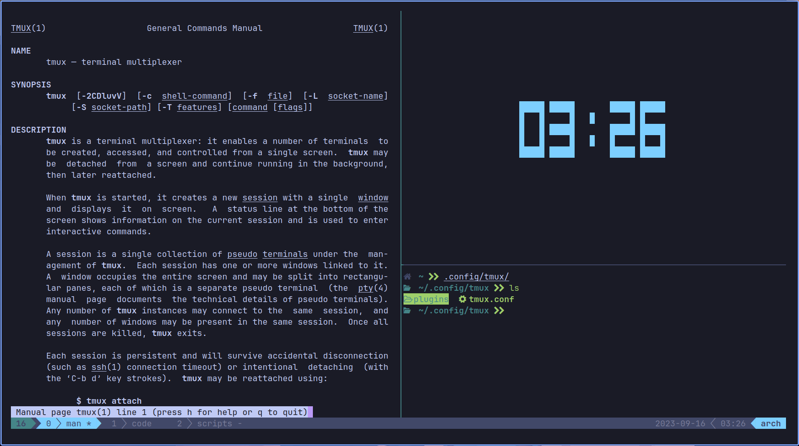

# My Dotfiles

Welcome to my dotfiles repository – a place where my configurations get cozy with those of others.

In this repo, I've created my own configurations, twirled and borrowed those created by fellow enthusiasts, and formed a delightful symphony of customization. As we share and collaborate, the open-source spirit continues to thrive. So, join the party, explore, and make these dotfiles your own. After all, in this space, the sky's not the limit; it's just the beginning! 🚀🌌🔧

## Important Note

I use arch btw.  

## What's in the box?

You'll find cheatsheets, configs, and other goodies. Here's a quick overview:

### Cheatsheets

- [Tmux](tmux.md)
- [BSPWM](BSPWM.md)

### Configs

- BSPWM
- Neofetch
- Ranger
- Alacritty
- Tmux
- Zsh
- Bash
- LunarVim
- Vim
- Vscode
- Other configs (I'm lazy to list them all xD)

### Other Goodies

- [How to install Arch Linux](arch.md)
- [My Scripts](scripts/)
- [My Wallpapers](wallpapers/)

## Sneak Peek 👀

|             BSPWM                     |
| :-----------------------------------: |
|        |

|              NeoFetch                 |
| :-----------------------------------: |
|  |

|                Tmux                   |
| :-----------------------------------: |
|          |

|                Ranger                 |
| :-----------------------------------: |
|      |

|                 VIM                   |
| :-----------------------------------: |
|            |

|               LunarVim                |
| :-----------------------------------: |
|      |

|                VSCode                 |
| :-----------------------------------: |
|      |

## Contributing

Contributions are welcome, and they are greatly appreciated! Every little bit helps so feel free to submit a PR.

## Credits

My dotfiles owe their inspiration to a multitude of talented individuals in the open-source community. Though their names remain hidden within the lines of code and configuration files, their contributions have left an indelible mark on this repository. To these unsung heroes, I offer my sincerest thanks.

## License

This repository is licensed under the [GNU General Public License v3.0](https://www.gnu.org/licenses/gpl-3.0.en.html). Feel free to use, modify, and share these dotfiles as you please.